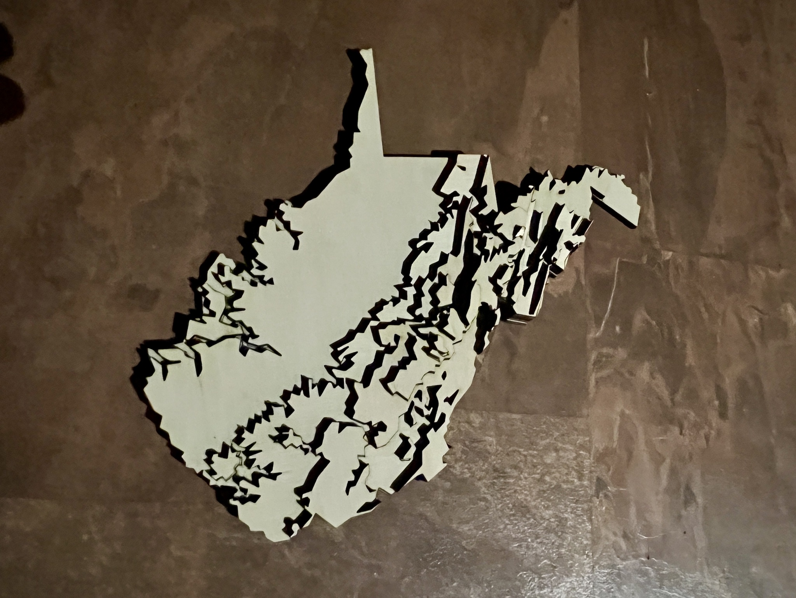

# laserdem

Convert Digital Elevation Model (DEM) raster files into layered DXF files for laser cutting 3D topographic models from plywood or acrylic sheets.



*West Virginia statewide 30m DEM cut from 1/4" plywood using a Boss 105W laser cutter with LaserBurn softwarer*


## Installation

Install Python dependencies:

```bash
$> pip install -r requirements.txt
```

If rasterio has trouble finding GDAL, specify your `gdal-config` path:

```bash
$> GDAL_CONFIG=/usr/local/bin/gdal-config pip install -r requirements.txt
```


## Usage

```bash
$> laserdem.py DEM INTERVAL OUTPUT_SIZE OUTPUT_DIR [OPTIONS]
```

### Required Arguments

- **`DEM`**         - Path to input DEM raster file (GeoTIFF, etc.)
- **`INTERVAL`**    - Contour interval in DEM elevation units
- **`OUTPUT_SIZE`** - Maximum output dimension in millimeters (model will be scaled to fit)
- **`OUTPUT_DIR`**  - Directory where DXF files will be written

### Optional Arguments

- **`--smooth RADIUS`**      - Gaussian smoothing radius in map units (e.g., meters for UTM DEMs). 
                               Reduces jagged edges. Default: 0 (no smoothing)
- **`--simplify TOLERANCE`** - Geometry simplification tolerance in millimeters. Reduces vertex count. Default: 0.5
- **`--min-island SIZE`**    - Remove island polygons smaller than SIZE mm (measured as side length;
                               removes islands with area < SIZE²). Default: 0 (keep all)
- **`--min-hole SIZE`**      - Remove holes smaller than SIZE mm (measured as side length;
                               removes holes with area < SIZE²). Default: 0 (keep all)


## Example

The West Virginia model shown above was created with:

```bash
$> laserdem.py test/WV_NED_feet_UTM83.tif 750 305 output/ \
    --smooth 900 --min-island 5 --min-hole 2 --simplify 1.0
```

This command:
- Uses a 30m NED DEM with elevation units of feet
- Creates tiers for every 750 feet of elevation (which results in 6 tiers)
- Scales output to 305mm (12 inches) maximum dimension, for 12x12 inch plywood sheets
- Applies 900m smoothing radius (reduces jaggedness)
- Removes islands smaller than 5mm and holes smaller than 2mm
- Simplifies geometry with 1.0mm tolerance for cutting software

Even with this level of geometry simplification, a few tiny pieces still fell through the perforated bed of the laser cutter, a tiny piece of plywood delaminated, and one was lost before being glued in place. Be sure to make use of the smoothing option, which downsamples and applies a gausian blur, especially for DEMs with fine spatial resolution. 


## Output

Each elevation tier generates a DXF file named `tier_NNNN.dxf` with these layers:

- **CUT**   (red)    - The shape to cut for this tier *(high power laser, cutting)*
- **ETCH**  (green)  - Outline of the next higher tier for alignment *(low power laser, etching)*
- **BBOX1** (blue)   - Bounding box of the entire DEM
- **BBOX2** (yellow) - Bounding box of this tier's geometry for material optimization

You can preview the .DXF files using QGIS, or with CAD software. Sorry, you're on your own with that.

From the LightBurn software, File->Import and load one .DXF file at a time. Configure the green ETCH layer for low-power laser output, and the red CUT layer for high-power laser output. After cutting a tier, you can select the geometry from the tier, then inport your next .DXF into the same project, retaining your laser configuration settings for the same layer colors/names.

Stack the laser-cut pieces in elevation order to build the physical 3D model.


## License

MIT License
